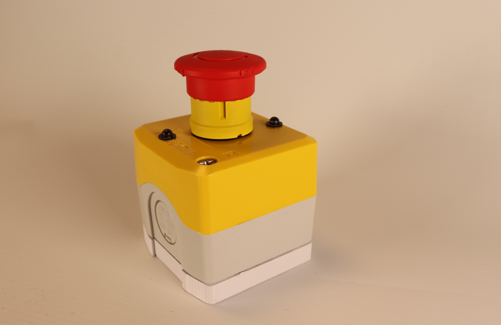
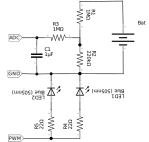

# ESP8266-based emergency stop button

This is the code for a wifi emergency stop built with the esp8266 wifi + microcontroller. We used the Adafruit Feather HUZZAH with ESP8266 for our own buttons. The board has battery management included and allows to measure the battery voltage (through a voltage divider).

This device will send UDP packets over the wifi network, following a simple ad hoc protocol described below. The consumer of these packets expects them to arrive at a given frequency. If for some set time, no packet arrived, it would stop our robot. As a result, we lower the risk of the robot not being stopped if there is a problem in the network communication or in the emergency stop itself.

Used pins on the board:

- It will read the current battery voltage (of our 3.7V, 1000mAh battery), using the only ADC (Analogue to Digital Conversion) pin available.
- It will blink a led wired to the pin 5 of the board
- The pin EN (enable) is pulled down when the emergency stop is triggered, switching off the device. This is the only single point of failure we know on this system.

## Configuring the device

There are two sets of parameters. The first ones are hard-coded in the source code, like the signature key (which should hence never be committed). The second set of parameters can be changed through the serial interface (type `h` and Enter to see the options). For more details, have a look at `config.hpp` and `config.cpp`.

## Dependency

We rely on [TickerScheduler] for a basic time-based scheduling of the different tasks which are 1. blinking the led (three tasks) 2. handling the configuration 3. sending heartbeats.

## Remarks

One of the fields of the heartbeat messages is the battery charge level. This information is based on the voltage on the battery and is very noisy. It is apparently mainly due to the ESP8266 Wifi module that disrupts analogue readings.

## Future improvements

### Led blinking based on the button's status

I think that it would be nice to have the blinking pattern of the leds change based on the status of the e-stop. Alternatively, there could be a second pair of LEDs (of a different color) for the status, that would blink only when the battery is low or when the connexion is lost.

### Directly wire the button on the battery

<!-- TODO: show electronic circuitry for this -->
<!-- TODO: BOM -->

Currently, the contactor in the emergency stop is a normally open (NO) one. This means that it lets the current cross it only when the button is pressed. When this happens, it will bridge the enable (EN) pin of the Huzzah board and the ground, cutting the voltage regulator on the board. The main drawback is that in case of miss-connection between the contactor and the Huzzah board, the button will cease to function, in the sense that pressing it would no longer stop the robot.

A solution would be to use a normally closed contactor that would be put between the battery and the microcontroller board. The main drawback of this approach is that we cannot reload the battery when the button is pressed.

To solve both issues, we could consider taking an external reloading circuit, directly connected to the battery. Then, the contactor would cut the connection between the battery/reloader and the main board. Additionally, if the only external Micro-USB port is the one of the reloading circuit, we would avoid the (faint) risk of having the microcontroller be reprogrammed by mistake.

### Make an opening in the button for the Micro-USB port

So that we can reload the battery easily and change the button's configuration if needed.

### Make a 3D-printed stand for the electronic boards

For now the electronics boards are just left floating in the button. We would design a stand for both boards (Huzzah and PCB) to be 3D printed. I think we should take advantage of the fixture for the contactors.

### Design and manufacture a PCB for the electronics

This might be done as a daughter board or as a simpler board with wire connecting it to the Huzzah.

It would also be nice to put a connector for each led, so that the button can be more easily opened.

## Hardware design

A little picture of our button, so that you understand what we mean:

### Electronics

The electronics here are extremely simple :

1. a voltage divider and low-pass filter for the measure of the battery's charge level
2. resistors for current-limitation on the two LEDs

For those who want more details, here is a schematic of the electronics:

Bill of materials for the board

component reference | value
---------|----------
 R1 & R3 | 1 Mohm
 R2 | 220 Kohm
 R4 | 22 ohm
 C1 | 1 uF
 LED1 & LED2 | blue led (Radio Spares 815-4366)

We also bought

### Mechanical

Bill of materials:

Designation | Radio Spares product number
----------|---------
 Emergency stop button | 330-8587
 Normally open contactor (for the button) | 331-0574

We also made a 3D printed part that would bit below the button, in order to host the too large battery. The design is available as STL in the hardware folder. It was designed with Onshape ([link to the original design](https://cad.onshape.com/documents/043af48d8279ec13bb06e1de/w/d73f08f1384db1234596df65/e/912adaf6e6cce1dc58b794c6)).